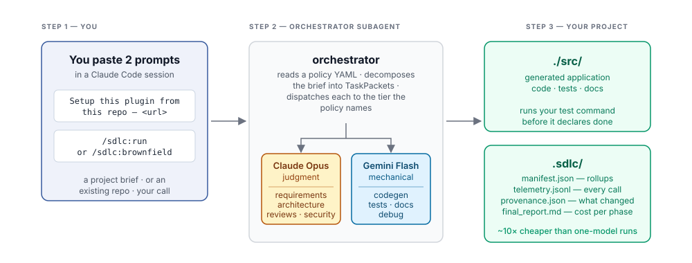
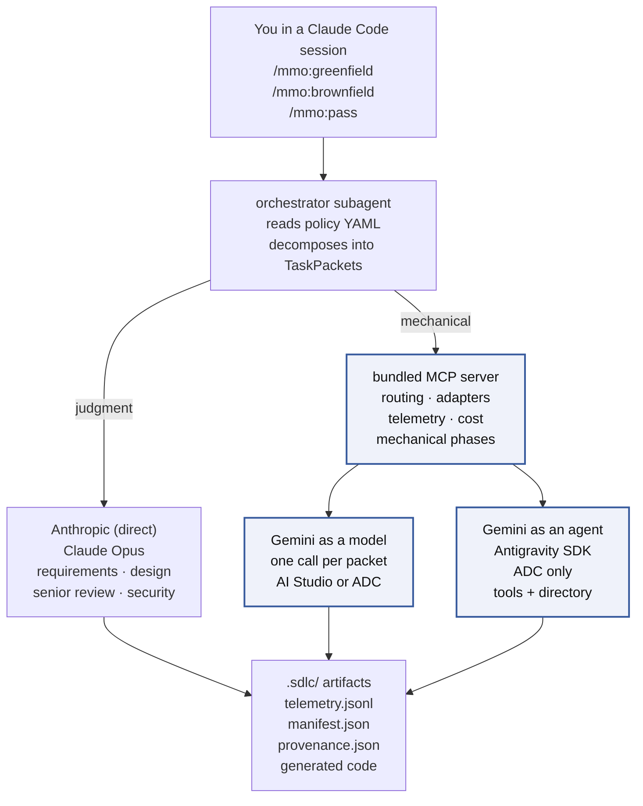
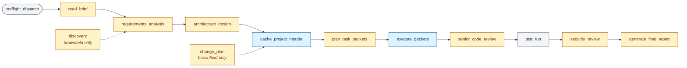
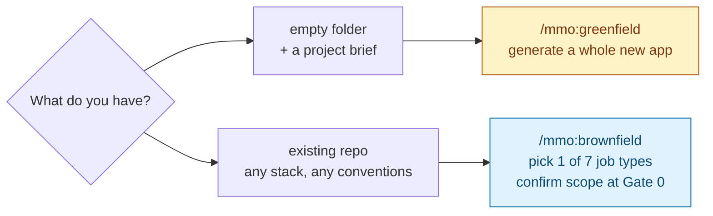

# AI-SDLC Orchestrator — Claude Code Harness

[](LICENSE)
[](https://github.com/tl-ai-labs/ai-sdlc-orchestrator-claude-code-harness/actions/workflows/ci.yml)
[](.claude-plugin/marketplace.json)



## What this is

A Claude Code plugin that runs a full SDLC pipeline — requirements → design → code → tests → docs → senior review → security review — against either an empty folder (**greenfield**) or an existing repository (**brownfield**). It routes each phase to the model that fits: judgment work stays on Claude Opus, mechanical work drops to Gemini Flash. A typical mid-size run costs cents where a one-model run would cost dollars.

Two Gemini paths reach the same model at the same price — one call per packet (`flash-completion`) or a full agent session with tools and a workspace (`flash-agsdk-worker`). You pick which door once at setup. See [docs/two-gemini-paths.md](docs/two-gemini-paths.md) for the measured comparison.

Every generated file, every telemetry event, and every cost report lands under your project directory. Nothing is uploaded off the machine.

## Architecture

### System dataflow



The highlighted path is where cost drops — mechanical work routed off Opus into the cheaper tier. Which door the mechanical tier uses (model vs agent) is picked once at setup; both reach the same model at the same published rates.

### Phase timeline

A greenfield run walks 11 states in order. Brownfield inserts two more (`discovery`, `change_plan`) around the same core. Each state is color-coded by which tier does the work.



Legend — **amber:** Claude Opus (judgment). **blue:** Gemini Flash (mechanical). **grey:** local — no model call.

Four HITL gates fire along the way: after requirements (Gate 1), after design (Gate 2), after security review (Gate 3), before final acceptance (Gate 4). Brownfield adds Gate 0 (discovery confirmation) before any of them.

The full plugin file inventory lives in [docs/architecture.md](docs/architecture.md).

## What it can do

### Tasks — the seven brownfield job types

Pick one at Gate 0 in `/mmo:brownfield`.

| Job type | When to use | Who does the heavy lifting |
|---|---|---|
| `docs` | Write API docs, README, ADRs, docstrings | Gemini Flash |
| `bugfix` | Fix a specific defect (reproduce → diagnose → fix → regression test) | Gemini Flash · escalates to Opus after 2 failed retries |
| `feature-extend` | Add a capability to an existing endpoint or module | Opus for change plan · Gemini for the edits |
| `feature-new` | Add a new subsystem (endpoint + storage + tests) | Opus for design · Gemini for full codegen mix |
| `refactor` | Extract shared logic; runs the **full** test suite for invariants | Opus for refactor plan · Gemini for `refactor_extract` + patches |
| `test` | Backfill tests to a coverage target | Gemini Flash |
| `deps` | Upgrade a dependency + patch breaking-change fallout | Opus for dep-swap plan · Gemini for adjacent-code patches |

Full intent-by-phase matrix in [plugin/skills/pipeline/SKILL.md:255](plugin/skills/pipeline/SKILL.md).

### Routing — model per phase

Same rule applies to greenfield and brownfield. The default `opus-plus-flash` policy routes:

| Phase | Tier | Model in the default policy |
|---|---|---|
| `requirements_analysis` · `architecture_design` · `plan_task_packets` | premium | Claude Opus |
| `senior_code_review` · `security_review` | premium | Claude Opus |
| `discovery` · `change_plan` (brownfield only) | premium | Claude Opus |
| `execute_packets` (codegen) · `tests` · `docs` | mechanical | Gemini Flash |
| `debug` (retry_count ≥ 2) | premium | Claude Opus (auto-escalation) |
| `test_run` | local | Bash on your machine, no model call |

Source: [plugin/config/policies/opus-plus-flash.yaml:64](plugin/config/policies/opus-plus-flash.yaml). Every rule is data — change routing by editing the YAML, or author a new policy in the browser console via `/mmo:policy change`.

Two guardrails ship on:

- **Escalation** — a mechanical-tier packet that fails validation twice auto-routes to Opus on the third attempt. Prevents infinite retries when Flash can't solve a particular puzzle.
- **Hard cost cap** — `$50` per run ([opus-plus-flash.yaml:135](plugin/config/policies/opus-plus-flash.yaml)). The orchestrator aborts cleanly if accumulated cost crosses it. Raise or remove in your own policy.

Two policies ship:

| Policy | Uses | Typical mid-size run cost |
|---|---|---|
| `opus-only` | Claude Opus for every phase | $10 – 30 |
| `opus-plus-flash` (default) | Opus for judgment, Gemini Flash for mechanical | $0.30 – 3 |

Deep dive: [docs/brownfield-routing.md](docs/brownfield-routing.md).

## Greenfield vs. brownfield



| Mode | Command | What it does |
|---|---|---|
| **Greenfield** | `/mmo:greenfield` | Generates a whole new application from a project brief into `./src/`. Original flow the plugin was built for. |
| **Brownfield** | `/mmo:brownfield` | Extends an existing repository. Pick one of the seven job types above, confirm scope at Gate 0, run the pipeline with a non-destructive write contract that guarantees off-limits files stay untouched. |

Both use the same install, same policies, same MCP dispatch layer. `/mmo:greenfield` in an existing repo warns you and offers `/mmo:brownfield` instead.

Brownfield reference:

- [docs/brownfield.md](docs/brownfield.md) — overview + Gate 0 walkthrough
- [docs/brownfield-write-contract.md](docs/brownfield-write-contract.md) — how the write contract enforces "never touch off-limits"
- [docs/brownfield-coexistence.md](docs/brownfield-coexistence.md) — coexistence with Cursor, Aider, Copilot, custom MCP
- [docs/brownfield-privacy.md](docs/brownfield-privacy.md) — data flow, private endpoints, regulated repos

## Prerequisites — what you actually need

Framed by what you want to do, not by every provider that exists. Full provider matrix (env vars, verify commands, failure modes) is in [docs/setup.md](docs/setup.md).

| If you want to… | You need |
|---|---|
| **Try it at all** | Node.js 20+, Claude Code CLI, macOS/Linux/WSL2, and either an `ANTHROPIC_API_KEY` **or** a Claude Code subscription (sign in once with `claude`) |
| **Get the ~10× cost drop** | The above, plus a Gemini surface — a `GEMINI_API_KEY` from [AI Studio](https://aistudio.google.com/app/apikey), or Application Default Credentials from `gcloud auth application-default login` |
| **Use the Antigravity agent path** | The above, plus Python 3.10+ (macOS ships 3.9, too old) **and** Vertex ADC — there is no API-key door for the agent path |

That's it. You don't need to pick a Gemini door yourself — setup asks. You don't need to write a policy — `opus-plus-flash` loads by default.

## Setup — the two-prompt flow

Nothing to clone, nothing to type by hand.

**Prompt 1 — setup.** Paste this verbatim in a fresh Claude Code session:

```
Setup this plugin from this repo - https://github.com/tl-ai-labs/ai-sdlc-orchestrator-claude-code-harness
```

Claude Code follows [SETUP.md](SETUP.md): registers the marketplace, installs the plugin, builds the bundled MCP server, checks credentials, asks whether to enable the Antigravity SDK agent path (only when Google Cloud credentials are present), and opens the browser once to pick this project's default model policy (or hit Save on `opus-plus-flash`).

**Prompt 2 — run.** Start a **new session in the same folder**, then whichever fits:

```
/mmo:greenfield             # greenfield: empty folder + project brief
/mmo:brownfield      # brownfield: existing repo, pick a job type
```

Both check the install, show which model each phase will run on, confirm the plan (Gate 0 in brownfield), and only then start spending.

> **Why a new session matters.** Claude Code registers a plugin's slash commands and starts its MCP servers only when a session begins. In the install session, `/mmo:greenfield`, `/mmo:brownfield`, and the bundled server are not yet live — a run started there would route every phase to the premium model.

## Commands

Six commands, split by purpose. All are declared in [plugin/commands/](plugin/commands/) with the same descriptions shown here.

### Run the pipeline

| Command | What it does | When to use it |
|---|---|---|
| [`/mmo:greenfield`](plugin/commands/greenfield.md) | Runs the greenfield pipeline. Interviews you for the brief (or reads one you point at), confirms the output path, shows the routing plan, then starts spending. Takes no arguments. | Empty folder + a project brief. Generates a whole new app into `./src/`. |
| [`/mmo:brownfield`](plugin/commands/brownfield.md) | Runs the brownfield pipeline. Hydrates prior state, runs discovery (or resumes), asks for the intent and brief, freezes scope at Gate 0, then executes. Takes no arguments. | Existing repo. Extends the code you already have. |
| [`/mmo:pass`](plugin/commands/pass.md) | Headless twin of the two above. Every setting a flag: `--auth=vendor\|estimated`, `--policy`, `--mode=greenfield\|brownfield`, `--intent`, `--brief`, `--gates`, `--strict-write`, and more. | CI, scripted replays, batch runs. |

### Setup and configuration

| Command | What it does | When to use it |
|---|---|---|
| [`/mmo:setup`](plugin/commands/setup.md) | Rebuilds the MCP server, re-checks credentials, opens the browser only when a human decision is genuinely needed (missing key, Gemini door choice, policy pick). Idempotent. | After `/plugin update`, a credential change, or an unexpected refusal. Also the everyday "did I set this up right?" check. |
| [`/mmo:policy`](plugin/commands/policy.md) | Bare: prints the active policy for this project. `change`: opens the browser console to pick or author a new one. `--policy=<name>`: silent set, no browser. Per-project — writes `.sdlc/project.json.default_policy`. | Check or change which policy this project uses. |

### Undo

| Command | What it does | When to use it |
|---|---|---|
| [`/mmo:revert <run-id>`](plugin/commands/revert.md) | Reads `.sdlc/runs/<run-id>/provenance.json` and restores each touched file to its pre-run state — git checkout for tracked-committed files, per-run backup for uncommitted ones. Refuses in dirty cases and prints a three-way diff instead. No `--force`. Flags: `--skip-dirty`, `--dry-run`, `--keep-backups`. | Undoing a specific brownfield run. |

Full flag surface for `/mmo:pass` is in [docs/running.md](docs/running.md).

## What a run produces

Every artifact lands under `./.sdlc/` (for `/mmo:greenfield`) or `examples/<study-id>/passes/<run-id>/` (for `/mmo:pass`). Generated source lands under `./src/`.

| File | Contents |
|---|---|
| `telemetry.jsonl` | One JSON line per LLM call: phase, model, tokens (input / cached / output), cost, latency, task_id. |
| `manifest.json` | Rollup of the telemetry: totals, per-phase, per-module, per-task-type. |
| `provenance.json` | Every file the run touched, with pre-run hash — the input `/mmo:revert` reads. |
| `delegation/` | Only on runs that used the agent path. Three files per delegated packet: task brief, worker usage sidecar, receipt. |
| `.hook-logs/hook.jsonl` | One line per `execute_with_model` call. Backup heartbeat; safe to delete. |
| Cost report | `node tools/report.mjs <pass-dir>` — per-phase table, delegation table if any, total cost, methodology footer. |

Full reference in [docs/understanding-output.md](docs/understanding-output.md).

## Try it — one worked example

The [Ping Service](examples/quick-demo/) brief run on `opus-plus-flash`, mechanical phases going to Gemini as a model:

```
Wall-clock:   28 minutes
Model calls:  11, of which 5 dispatched packets (one retried)
Tokens:       43,027 in / 33,647 out
Recorded cost: $0.84
```

Full recorded output — `.sdlc/`, `src/`, both readmes — is in [examples/quick-demo/passes/model-path/](examples/quick-demo/passes/model-path/). The same brief down the other door is in [examples/quick-demo/passes/agent-path/](examples/quick-demo/passes/agent-path/). Render the cost report yourself:

```bash
node tools/report.mjs examples/quick-demo/passes/model-path
```

Step-by-step walkthrough of a real first run: [docs/tutorial-first-run.md](docs/tutorial-first-run.md).

## Verify or repair the install

Re-run the setup check any time. `/mmo:setup` rebuilds the MCP server, re-checks credentials, and pauses only when a human decision is needed:

```
/mmo:setup
```

Also the repair after `/plugin update`, which re-copies the plugin from source and removes the build. The raw script still works for scripted invocation:

```bash
node "$(ls -d ~/.claude/plugins/cache/tilicho-ai-labs/mmo/*/scripts/verify-setup.mjs | tail -1)" --fix
```

## Clone route

For readers who cannot use the plugin marketplace:

```bash
git clone https://github.com/tl-ai-labs/ai-sdlc-orchestrator-claude-code-harness.git
cd ai-sdlc-orchestrator-claude-code-harness
node tools/setup.mjs
```

`tools/setup.mjs` runs the same checks the plugin route runs, installs the MCP server's dependencies, builds it, and writes `.mcp.json`.

## Documentation

- [docs/setup.md](docs/setup.md) — providers, credentials, both Gemini doors
- [docs/running.md](docs/running.md) — the pipeline, policies, bringing your own brief
- [docs/brief-template.md](docs/brief-template.md) — the section layout a brief needs
- [docs/architecture.md](docs/architecture.md) — plugin surface, MCP server, adapters, telemetry, full file inventory
- [docs/troubleshooting.md](docs/troubleshooting.md) — symptom → cause → fix
- [docs/understanding-output.md](docs/understanding-output.md) — reading the report and the raw files
- [docs/methodology.md](docs/methodology.md) — how tokens and costs are recorded
- [docs/two-gemini-paths.md](docs/two-gemini-paths.md) — measured comparison of the two doors on the same brief
- [docs/brownfield-routing.md](docs/brownfield-routing.md) — which model does which work
- [docs/walkthroughs/](docs/walkthroughs/) — the two Gemini paths, frame by frame ([model](docs/walkthroughs/model-path.html), [agent](docs/walkthroughs/agent-path.html))
- [examples/quick-demo/](examples/quick-demo/) — smallest brief, one endpoint, minutes to run
- [examples/workforce-ops/](examples/workforce-ops/) — the reference brief
- [examples/travel-ops/](examples/travel-ops/) — a second brief (booking, cancellation, refund handling)

## License

MIT — see [LICENSE](LICENSE).

---

<p align="center">
  <a href="https://tilicho.in">
    
  </a>
  <br />
  Built and maintained by <a href="https://tilicho.in">Tilicho</a>.
</p>
