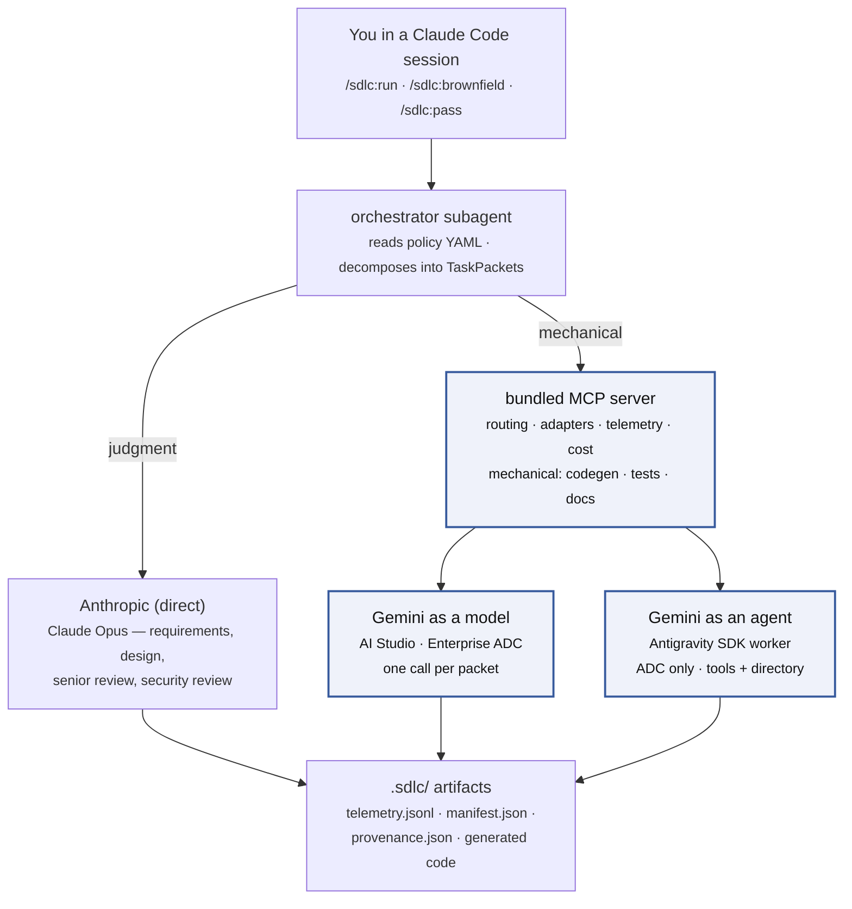

# AI-SDLC Orchestrator — Claude Code Harness

[](LICENSE)
[](https://github.com/tl-ai-labs/ai-sdlc-orchestrator-claude-code-harness/actions/workflows/ci.yml)
[](.claude-plugin/marketplace.json)

## What this is

A Claude Code plugin that runs an AI-SDLC pipeline against either a project brief (greenfield —
generate a whole new app) or an existing repository (brownfield — extend the code you already
have). Requirements → design → task planning → codegen → tests → docs → senior review → security
review → debug. Four of the phases stop at human approval gates. Two Gemini doors — as a model
(Gemini Enterprise Agent Platform, formerly Vertex AI, or AI Studio) or as an agent (Antigravity
SDK) — reach the same mechanical tier. Two
auth modes — `vendor` (bills your Anthropic API key, reconciles to the dashboard) or
`estimated` (subscription auth, char-count heuristic). Every telemetry event, every generated
file, and the cost report land under the project directory. Nothing is uploaded off the machine.

## Greenfield vs. brownfield

Two task commands, one shared setup and machinery:

| You have… | Command | What it does |
|---|---|---|
| An **empty folder** | `/sdlc:run` | Generates a whole new application from a project brief. The original greenfield flow. |
| An **existing repo** (any stack, any conventions) | `/sdlc:brownfield` | Pick one of seven job types (docs, bugfix, feature-extend, feature-new, refactor, test, deps), confirm scope at Gate 0, then run the pipeline with a non-destructive write contract that guarantees off-limits files stay untouched. |

Both use the same install (SETUP.md), same policies, same MCP dispatch layer. `/sdlc:run` in
an existing repo now warns you and offers `/sdlc:brownfield` instead — treating your real code
as an empty canvas is almost certainly not what you want.

Brownfield-specific documentation:

- [docs/brownfield.md](docs/brownfield.md) — overview + gate walkthrough
- [docs/brownfield-write-contract.md](docs/brownfield-write-contract.md) — how the write
  contract enforces "never touch off-limits"
- [docs/brownfield-coexistence.md](docs/brownfield-coexistence.md) — coexistence with your
  other AI tools (Cursor, Aider, Copilot, custom MCP)
- [docs/brownfield-privacy.md](docs/brownfield-privacy.md) — data flow, private endpoints,
  regulated repos
- [docs/brownfield-setup-issues.md](docs/brownfield-setup-issues.md) — the 17 known
  setup-time issues + their handling
- [docs/brownfield-routing.md](docs/brownfield-routing.md) — which model does which work

## The two-prompt flow

The primary UX. Nothing to clone, nothing to type by hand.

**Prompt 1 — setup.** Paste this verbatim:

```
Setup this plugin from this repo - https://github.com/tl-ai-labs/ai-sdlc-orchestrator-claude-code-harness
```

Claude Code follows [SETUP.md](SETUP.md): registers the marketplace, installs the plugin,
builds the bundled MCP server, checks credentials, asks whether to enable the Antigravity
SDK agent path (only when Google Cloud credentials are present), and opens the browser once
to pick this project's default model policy (or hit Save on `opus-plus-flash`). For brownfield
mode, add `--brownfield-check` to `verify-setup.mjs` and it also runs the additional
Node/git/permission checks and the credential discovery scan.

**Prompt 2 — run.** Start a new session in the same folder, then whichever fits:

```
/sdlc:run             # greenfield: empty folder + project brief
/sdlc:brownfield      # brownfield: existing repo, pick a job type
```

Both check the install, show which model each phase will run on, confirm the plan (with a
Gate 0 in brownfield), and only then start spending. Generated code lands where it should —
`./src` for greenfield, the paths you confirmed at Gate 0 for brownfield. Telemetry, manifest,
and cost report always land under `.sdlc/`.

Three task-agnostic commands cover setup and per-project routing:

```
/sdlc:setup           # re-verify or re-configure (safe to re-run anytime)
/sdlc:policy          # show the active policy; `/sdlc:policy change` opens the console
/sdlc:pass            # headless / scripted run — every setting as a flag
```

The new session matters. Claude Code registers a plugin's slash commands and starts its MCP
servers only when a session begins, so `/sdlc:run`, `/sdlc:brownfield`, and the bundled server
are not live in the install session — a run started there would route every phase to the
premium model.

## Before you start

| Requirement | Detail | Why |
|---|---|---|
| Node.js | 20 or newer | The MCP server and setup scripts. Verify with `node --version`. |
| Claude Code CLI | any | The plugin runs inside it. Install with `npm install -g @anthropic-ai/claude-code`. |
| Shell | macOS, Linux, or WSL2 | The scripts are POSIX bash. |
| Anthropic access | API key **or** Claude Code subscription | Every policy uses Opus for judgment phases. See [Providers](#providers). |
| Google (Gemini) access | Gemini Enterprise Agent Platform ADC, AI Studio key, or none | Needed only by the multi-model policy. Skip for `opus-only`. |
| Python | 3.10+ | Only if you enable the Antigravity SDK agent path. macOS ships 3.9, which is too old. |

## Architecture at a glance

A Claude Code subagent (`orchestrator`) reads a policy YAML, decomposes the brief into TaskPackets, and dispatches each packet to the model the policy names. Judgment phases (requirements, design, reviews) go direct to Anthropic; mechanical phases (codegen, tests, docs) go through the bundled MCP server, which owns adapters, credential discovery, telemetry, and cost accounting. Greenfield runs nine phases; brownfield adds `discovery` and `change_plan` around the same core.



The highlighted path is where cost drops — mechanical work routed off Opus into the cheaper tier. Which door the mechanical tier uses (model vs agent) is picked once at setup; both reach the same model at the same published rates. See [two Gemini paths](docs/two-gemini-paths.md) for the measured comparison.

Full inventory:

| Piece | File |
|---|---|
| Plugin manifest | [plugin/.claude-plugin/plugin.json](plugin/.claude-plugin/plugin.json) |
| Marketplace entry | [.claude-plugin/marketplace.json](.claude-plugin/marketplace.json) |
| Orchestrator subagent | [plugin/agents/orchestrator.md](plugin/agents/orchestrator.md) |
| Slash commands (greenfield) | [plugin/commands/run.md](plugin/commands/run.md), [plugin/commands/pass.md](plugin/commands/pass.md) |
| Slash commands (brownfield) | [plugin/commands/brownfield.md](plugin/commands/brownfield.md), [plugin/commands/revert.md](plugin/commands/revert.md) |
| Slash commands (setup / policy) | [plugin/commands/setup.md](plugin/commands/setup.md), [plugin/commands/policy.md](plugin/commands/policy.md) |
| Discovery subagent (brownfield) | [plugin/agents/discovery.md](plugin/agents/discovery.md) |
| Stack adapters | [plugin/skills/run-ai-sdlc/stacks/](plugin/skills/run-ai-sdlc/stacks/) |
| Write-contract hook (brownfield) | [plugin/scripts/write-contract-check.mjs](plugin/scripts/write-contract-check.mjs) |
| MCP server entry | [plugin/mcp/gemini-flash-server/src/server.ts](plugin/mcp/gemini-flash-server/src/server.ts) |
| Routing | [plugin/mcp/gemini-flash-server/src/routing.ts](plugin/mcp/gemini-flash-server/src/routing.ts) |
| Adapters | [plugin/mcp/gemini-flash-server/src/adapters/](plugin/mcp/gemini-flash-server/src/adapters/) |
| Two Gemini doors | [plugin/mcp/gemini-flash-server/src/adapters/geminiTransports.ts](plugin/mcp/gemini-flash-server/src/adapters/geminiTransports.ts) |
| Agent worker | [plugin/mcp/gemini-flash-server/worker/gemini_worker.py](plugin/mcp/gemini-flash-server/worker/gemini_worker.py) |
| Policies | [plugin/config/policies/](plugin/config/policies/) |
| Policy console (single-page browser UI + tiny http server, per-project setup) | [plugin/policy-console/](plugin/policy-console/), [plugin/scripts/setup-policy.mjs](plugin/scripts/setup-policy.mjs) |
| Project state | `.sdlc/project.json` (per-project defaults: `default_policy`, `off_limits_default`) |
| Pre-flight | [plugin/mcp/gemini-flash-server/src/preflight.ts](plugin/mcp/gemini-flash-server/src/preflight.ts) |
| Telemetry | [plugin/mcp/gemini-flash-server/src/telemetry.ts](plugin/mcp/gemini-flash-server/src/telemetry.ts) |
| Verify / repair | [plugin/scripts/verify-setup.mjs](plugin/scripts/verify-setup.mjs) (or use `/sdlc:setup`) |

Details in [docs/architecture.md](docs/architecture.md).

## Providers

The pipeline needs at least one Anthropic surface and, for the multi-model policy, one Gemini surface. Details, verify commands, and failure modes are in [docs/setup.md](docs/setup.md).

### Anthropic

| Variable | When required | Notes |
|---|---|---|
| `ANTHROPIC_API_KEY` | `--auth=vendor` runs | Get one at [console.anthropic.com](https://console.anthropic.com/settings/keys). |
| — | `--auth=estimated` runs | Sign in with `claude` once; no key required. |

### Gemini as a model — AI Studio (API key)

| Variable | Default | Notes |
|---|---|---|
| `GEMINI_API_KEY` | — | Get one at [aistudio.google.com/app/apikey](https://aistudio.google.com/app/apikey). |

### Gemini as a model — Gemini Enterprise Agent Platform, formerly Vertex AI (Application Default Credentials)

| Variable | Default | Notes |
|---|---|---|
| — | — | Run `gcloud auth application-default login`. Writes a credentials file; no env var required. |
| `GOOGLE_CLOUD_PROJECT` | from the credentials file | Set when the account has more than one project. |
| `GOOGLE_CLOUD_LOCATION` | `global` | Pinning a region bills a **+10% surcharge** on Gemini 3 and later. The plugin applies it to the reported cost. |
| `GEMINI_BACKEND` | auto-detected | `vertex` or `api-key` — forces the door when both credentials are present. |

If both an API key and Vertex credentials are present, the API key wins.

### Gemini as an agent — Antigravity SDK

| Variable | Default | Notes |
|---|---|---|
| — | — | Vertex ADC only. There is no API-key door. Needs Python 3.10+. |
| `SDLC_SELECT` | unset | Written by `verify-setup.mjs --enable-agent`. Do not set by hand: it is a `slot=option` pair, and writing the option alone (`flash-agsdk-worker`) passes offline checks and throws at policy load. |
| `GEMINI_WORKER_PYTHON` | plugin-built venv | Point at an interpreter you already maintain to skip the built-in venv. |

## Policies

Two policies ship. Pick one per run.

| Policy | Uses | Env needed |
|---|---|---|
| `opus-only` | Claude Opus for every phase | Anthropic only |
| `opus-plus-flash` | Opus for judgment; Gemini 3.5 Flash for mechanical (codegen, tests, docs) | Anthropic + Gemini |

`opus-plus-flash` reaches the mechanical tier through one of two policy leaves, `flash-completion` (model) or `flash-agsdk-worker` (agent). Which leaf a run uses is chosen once at setup and recorded in `SDLC_SELECT` as a `slot=option` pair. The setup wizard and `verify-setup.mjs --enable-agent` are the only supported ways to write it. The routing layer refuses malformed specs at policy load, before any dispatch is paid for. See [docs/architecture.md#routing](docs/architecture.md#routing).

## What the run produces

Every artifact lands under `./.sdlc/` (for `/sdlc:run`) or `examples/<study-id>/passes/<run-id>/` (for `/sdlc:pass`). Generated source lands under `./src/`.

| File | Contents |
|---|---|
| `telemetry.jsonl` | One JSON line per LLM call: phase, model, tokens (input / cached / output), cost, latency, task_id. |
| `manifest.json` | Rollup of the telemetry: totals, per-phase, per-module, per-task-type. |
| `delegation/` | Only on runs that used the agent path. Three files per delegated packet: the task brief, the worker's own usage sidecar, and the receipt joining them to the on-disk diff. |
| `.hook-logs/hook.jsonl` | One line per `execute_with_model` call. Backup heartbeat; safe to delete. |
| Cost report (from `node tools/report.mjs <pass-dir>`) | Per-phase table, delegation table if any, total cost, methodology footer. |

Full reference in [docs/understanding-output.md](docs/understanding-output.md).

## Verify or repair the install

Re-run the setup check at any time. `/sdlc:setup` is the everyday form — it rebuilds the MCP server, re-checks credentials, and pauses only when a human decision is needed:

```
/sdlc:setup
```

Also the repair after `/plugin update`, which re-copies the plugin from source and removes the build. The raw script still works if you need a scripted invocation:

```bash
node "$(ls -d ~/.claude/plugins/cache/tilicho-ai-labs/sdlc/*/scripts/verify-setup.mjs | tail -1)" --fix
```

## Clone route

For readers who cannot use the plugin marketplace:

```bash
git clone https://github.com/tl-ai-labs/ai-sdlc-orchestrator-claude-code-harness.git
cd ai-sdlc-orchestrator-claude-code-harness
node tools/setup.mjs
```

`tools/setup.mjs` runs the same checks the plugin route runs, installs the MCP server's dependencies, builds it, and writes `.mcp.json`. Full flag surface for `/sdlc:pass` is documented in [docs/running.md](docs/running.md).

## Documentation

- [docs/setup.md](docs/setup.md) — providers, credentials, both Gemini doors
- [docs/running.md](docs/running.md) — the pipeline, policies, bringing your own brief
- [docs/brief-template.md](docs/brief-template.md) — the section layout a brief needs
- [docs/architecture.md](docs/architecture.md) — plugin surface, MCP server, adapters, telemetry
- [docs/troubleshooting.md](docs/troubleshooting.md) — symptom → cause → fix
- [docs/understanding-output.md](docs/understanding-output.md) — reading the report and the raw files
- [docs/methodology.md](docs/methodology.md) — how tokens and costs are recorded
- [docs/two-gemini-paths.md](docs/two-gemini-paths.md) — measured comparison of the two doors on the same brief
- [docs/walkthroughs/](docs/walkthroughs/) — the two Gemini paths, frame by frame ([model](docs/walkthroughs/model-path.html), [agent](docs/walkthroughs/agent-path.html))
- [examples/quick-demo/](examples/quick-demo/) — smallest brief, one endpoint, minutes to run; both paths recorded under `passes/`
- [examples/workforce-ops/](examples/workforce-ops/) — the reference brief
- [examples/travel-ops/](examples/travel-ops/) — a second brief (booking, cancellation, refund handling)

## License

MIT — see [LICENSE](LICENSE).

---

<p align="center">
  <a href="https://tilicho.in">
    
  </a>
  <br />
  Built and maintained by <a href="https://tilicho.in">Tilicho</a>.
</p>
