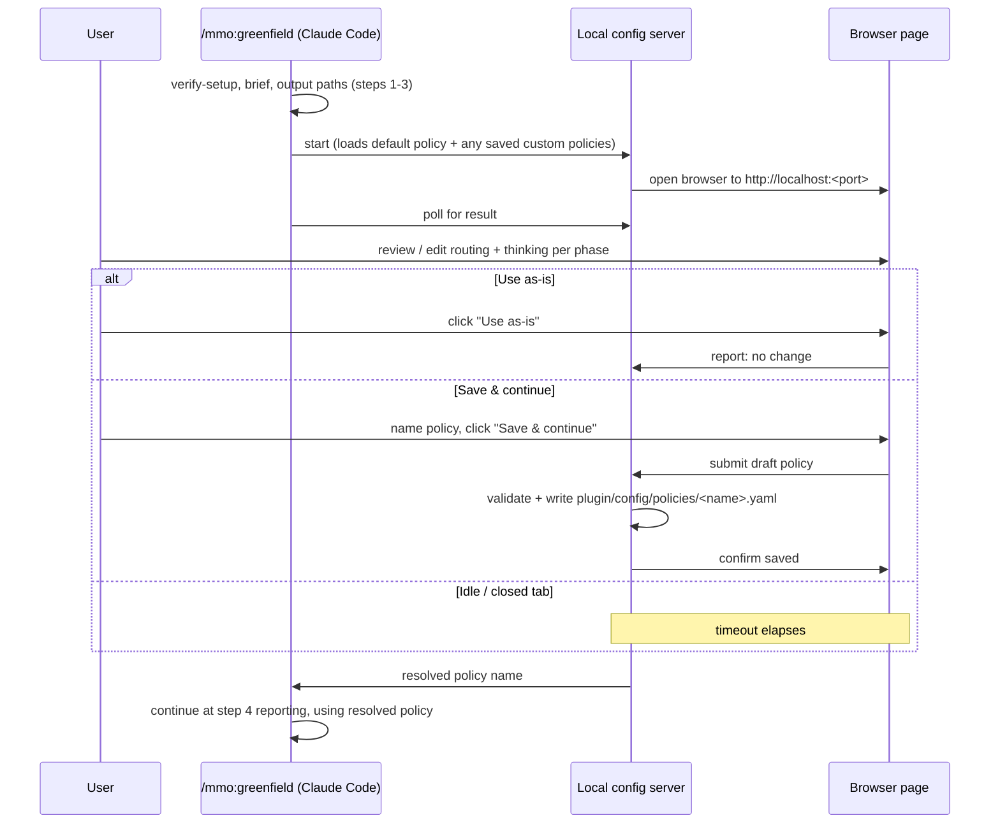

# PRD — Custom Policy & Per-Phase Thinking Capacity Configuration

**Status:** Draft for review
**Owner:** Vaibhav
**Repo:** `ai-sdlc-orchestrator-claude-code-harness`
**Requested via:** Slack ([@Vaibhav](https://tilicholabs.slack.com/team/U087TFUDL23)), 2026-08-12

---

## 1. Problem Statement

Today `/mmo:greenfield` routes every phase using whichever policy YAML is on disk
(`opus-plus-flash` by default, or `opus-only` as a fallback) and the
[run.md](../../plugin/commands/greenfield.md) command says so explicitly: *"This first
version runs the default policy. It is not configurable from this command; a user who needs
different routing edits the policy file directly."* Changing routing means hand-editing YAML —
finding the right file, knowing the schema (`models`, `select`, `rules`), and understanding phase
names — before a run can even start.

Two things compound this:

1. **Model-per-phase routing is the only lever.** Extended-thinking capacity
   (`ReasoningConfig` in [types.ts](../../plugin/mcp/model-dispatch/src/types.ts)) is
   currently attached to a *model*, not a *phase*. A judgment phase (requirements) and a
   mechanical phase (codegen) routed to the same model are stuck with the same thinking
   effort, even though they have very different reasoning needs.
2. **There is no low-friction way to try a variant.** A user who wants "opus-plus-flash, but
   with security_review on high thinking and debug capped at low" has to copy a YAML file by
   hand, edit it correctly, and remember to point the run at it — with no validation until the
   run fails mid-phase.

The people affected are anyone running `/mmo:greenfield` who wants routing or thinking-effort
different from the two shipped presets — which, since this is the pipeline's main cost lever, is
most repeat users. Left unsolved, users either overpay (staying on `opus-only` to avoid YAML
surgery) or risk a misconfigured policy failing partway through a paid run.

## 2. Goals

1. A user can choose an existing policy, or customize one and save it under a new name, without
   hand-editing YAML.
2. A user can set extended-thinking effort **per SDLC phase** (not just per model), for the
   first time — today this axis does not exist at all.
3. Configuration happens **in-flow**: the page opens automatically as part of `/mmo:greenfield`,
   before spend starts, and the CLI session resumes with the user's choice — no separate app to
   remember to launch.
4. A saved custom policy is a real, inspectable YAML file the user can find, re-run, hand-edit,
   or delete afterward — the web page is a generator for the same artifact a user would have
   written by hand, not a hidden or opaque state store.
5. Misconfiguration is caught before the run starts (schema/model/auth validation), not after a
   phase has already been billed.

## 3. Non-Goals

- **Not a general policy-YAML editor.** Raw fields the shipped presets don't vary today (adapter
  wiring, pricing, `select` slot definitions for Gemini's two doors) stay hand-edit-only in v1.
  Rationale: those fields are rarely touched and getting them wrong is higher-stakes than
  model/thinking choice; scope creep here delays the feature for a rare use case.
- **Not a hosted/multi-user web app.** The page is a localhost-only, single-run tool, not a
  persistent dashboard. Rationale: this is a CLI plugin for solo/local use; a hosted UI is a
  different product with different security requirements.
- **Not a policy marketplace or sharing mechanism.** No cloud sync, no team library of custom
  policies. Rationale: out of scope until there's evidence multiple people share a project's
  `.sdlc` history; local file + git is enough for v1.
- **Not a mid-run editor.** Once step 6 of `run.md` starts, the policy is locked for that
  run — no live reconfiguration between phases. Rationale: telemetry/cost reporting assumes one
  policy per run; changing it mid-flight breaks that invariant and the four approval gates
  already give a natural checkpoint structure.
- **Not model/adapter management.** Adding a brand-new model or adapter (a third LLM vendor) is
  still a code change, not something the config page exposes. Rationale: that touches
  `adapters/`, auth wiring, and pricing verification — a different, higher-risk change surface.

## 4. User Stories

1. As a user running `/mmo:greenfield`, I want a web page to open automatically before the run starts
   so I can review and adjust routing without leaving my terminal flow or hand-editing files.
2. As a user, I want to pick from the existing named policies (`opus-only`, `opus-plus-flash`,
   any others later added) as a starting point, so I'm not building routing from scratch.
3. As a user, I want to change which model handles a given phase and see the resulting cost
   shift, so I can make an informed trade-off before spending money.
4. As a user, I want to set extended-thinking effort independently for each of the nine phases,
   so a judgment phase (e.g. `architecture_design`) can run high-effort thinking while a
   mechanical phase (e.g. `docs`) stays cheap.
5. As a user, I want to save my changes as a new named policy (not overwrite the preset I
   started from), so the original presets stay reliable baselines I can always fall back to.
6. As a user, I want the run to pick up my saved choice automatically after I submit the page,
   so I don't have to re-enter anything back in the terminal.
7. As a user, I want to close the page without saving and have the run fall back to the default
   policy unchanged, so exploring the page is never destructive.
8. As a user, I want obviously bad input (duplicate policy name, a phase routed to a model with
   no credentials configured) caught on the page itself, so I don't discover it after a phase has
   already been billed.
9. As a user who ran this before, I want to see my previously saved custom policies as options
   next time, so a one-time setup isn't repeated every run.
10. As a user without a GUI/browser available in my environment (headless/CI/remote shell), I
    want the run to still proceed on the default policy rather than hang waiting for a page that
    can't open.

## 5. User Flow

**Where it slots in:** between the existing step 4 ("Show what will run") and step 5 ("Choose
telemetry mode") of [run.md](../../plugin/commands/greenfield.md).

1. `verify-setup.mjs` passes (existing step 1).
2. Brief is found/confirmed (existing step 2), output paths confirmed (existing step 3).
3. **New:** the command starts a local config server, opens the default browser to it, and
   prints the URL as a fallback (for headless/remote sessions — see US10). The CLI blocks,
   polling for the page to report a result.
4. The page shows the current default policy's routing and thinking settings as a live-editable
   table (see §6). The user either:
   - clicks **Use as-is** (no changes) → server reports "no changes," CLI proceeds with the
     existing default policy, nothing new written to disk; or
   - edits routing/thinking, gives the result a new policy name, clicks **Save & continue** →
     server writes `plugin/config/policies/<name>.yaml` (validated first — see §8), reports the
     new policy name back to the CLI; or
   - closes the tab / lets it sit idle past a timeout → CLI proceeds on the existing default
     policy after a clearly-stated timeout (recommend 10 minutes; see open question OQ-4), so a
     user who wandered off doesn't leave the session hung indefinitely.
5. The server shuts down once it has reported a result (or the CLI's poll times out).
6. Existing step 4 reporting ("which model handles which phase, at what rates") re-runs against
   the *resolved* policy — custom or default — so the user sees the real routing before step 5's
   spend confirmation, unchanged from today's behavior otherwise.
7. Existing steps 5–7 (telemetry mode, confirm, run, report) proceed unchanged, with `policy` in
   step 6 now pointing at whichever policy name resulted from step 4 above.

## 6. The Config Page

Single page, two linked sections, served from the local server started in flow step 3.

### 6.1 Policy section
- **Base policy selector** — dropdown of everything in `plugin/config/policies/*.yaml` (name +
  one-line description pulled from the YAML's leading comment), defaulted to whatever
  `run.md` step 4 would otherwise have used.
- **Routing table** — one row per SDLC phase (`requirements_analysis`, `architecture_design`,
  `plan_task_packets`, `codegen`, `tests`, `docs`, `senior_code_review`, `security_review`,
  `debug`), each with a dropdown of the base policy's declared model ids (and slot names, e.g.
  `gemini-flash`, shown with their current default option). Changing a row is a client-side diff
  against the base policy — unchanged rows stay visually neutral, changed rows are marked.
  `codegen`'s per-`task_type` sub-rules (12 task types in `opus-plus-flash.yaml`) are shown
  collapsed under the `codegen` row with their own overrides, since they can legitimately diverge
  from the phase-level default.
- **Live rate readout** — next to each row, the per-million input/output rate of the currently
  selected model, so cost impact is visible while editing (same numbers `run.md` step 4
  already reports, just live).

### 6.2 Thinking capacity section — implementation note
Built differently from this section's original draft, after auditing the real vendor SDKs and
docs (OQ-6): the tier picker sits **directly next to each phase's model dropdown** (one merged
row, not a separate section). Offered tiers are per model, and — this took three corrections to
get right — the field written depends on which real vendor parameter the model actually has:

- **Gemini** (`flash-completion`, `flash-agsdk-worker`): `off`/`minimal`/`low`/`medium`/`high`,
  written as `reasoning.tier` — the field `AntigravityWorkerAdapter` (the one adapter that reads
  reasoning at all) consumes. Sourced from the installed `@google/genai`/`google-genai`
  `ThinkingLevel` enum.
- **Opus** (`builtin-anthropic`): `off`/`low`/`medium`/`high`/`xhigh`/`max`, written as
  `reasoning.effort` — a genuinely different real request parameter,
  [`output_config.effort`](https://platform.claude.com/docs/en/build-with-claude/effort), not a
  synonym for Gemini's tier. `claude-opus-4-7` (this repo's pinned Opus model) rejects
  `thinking: {type: "enabled", budget_tokens}` outright per Anthropic's own docs — 4.7+ models
  dropped manual-budget thinking — but `output_config.effort` is separate from `thinking` entirely
  and is documented as supported on `claude-opus-4-7` specifically, with five real levels and
  Anthropic's own per-model guidance.

Picking a model that doesn't support the currently-set tier clamps it back to `off` rather than
saving a silently-invalid combination. Current, authoritative detail — including the two earlier,
wrong conclusions this replaced (that Opus has no thinking ability at all, then that it has none
worth a picker) — is in
[plugin/policy-console/README.md](../../plugin/policy-console/README.md#thinking-tiers-are-per-model--two-different-real-vendor-parameters).

### 6.3 Save controls
- **Policy name** field, required only when something differs from the base policy; validated
  live against existing file names in `plugin/config/policies/` (no collisions, filesystem-safe
  characters, matches the `name:` field written into the YAML).
- **Use as-is** button — always available, no name required.
- **Save & continue** button — enabled once a valid, non-colliding name is present and at least
  one change exists.
- Inline validation errors from §8 render next to the offending row before submission is allowed.

## 7. Data Model Changes

### 7.1 Per-phase thinking config (new)
`ReasoningConfig` today lives only on `ModelConfig` (types.ts:107-114). This feature needs the
same shape addressable **per phase**, independent of which model that phase resolves to on a
given run — because the same model id can be reused by rules with different reasoning needs
(e.g. `opus` used by both `requirements_analysis` and `debug` today, per
[opus-plus-flash.yaml](../../plugin/config/policies/opus-plus-flash.yaml)).

Proposed: extend `Rule` with an optional `reasoning?: ReasoningConfig` that, when present,
**overrides** the target model's own `reasoning` block for that rule only. Precedence:
`rule.reasoning` > `model.reasoning` > adapter default. This is additive — existing policies
with no `rule.reasoning` behave exactly as they do today. Needs a corresponding change in
whichever adapter code currently reads `ModelConfig.reasoning` (confirm all call sites before
implementation) to also check the resolved rule.

### 7.2 New policy files (not new format)
A saved custom policy is a normal policy YAML written to
`plugin/config/policies/<user-chosen-name>.yaml`, same schema as today's presets plus the §7.1
extension. No new persistence layer — the filesystem *is* the store, consistent with goal 4
(inspectable, hand-editable afterward).

### 7.3 Discovery
`run.md` step 4 / the new flow step 3 lists policies by globbing
`plugin/config/policies/*.yaml`, so a custom policy saved in one run is a normal pickable base
policy in the next (user story 9) — no separate index file to keep in sync.

## 8. Integration & Validation

- **`run.md`** gets a new step inserted between current steps 4 and 5 (see §5); current step
  4's reporting logic is unchanged, just re-pointed at the resolved policy.
- **Policy loading** — whatever currently parses/validates a policy YAML at run start (used by
  the orchestrator subagent and by `verify-setup.mjs`) must run the identical validation against
  a page-submitted policy *before* writing it to disk, so a custom policy can never reach disk in
  a state the run-start loader would reject. Concretely, at minimum:
  - every `rules[].use` target resolves to a declared `models[].id` or `select` slot (mirrors
    existing `validateSelectOverrides` logic in [routing.ts](../../plugin/mcp/model-dispatch/src/routing.ts))
  - every model referenced has its required `auth.env` credential present in the environment (so
    the page can warn *before* save, not fail at first dispatch)
  - policy `name:` field matches the filename
  - no filename collision with an existing policy
- **`verify-setup.mjs`** — confirm it doesn't hardcode the two shipped filenames anywhere; if it
  does, it needs to glob instead so a saved custom policy passes setup checks on a later run.
- **Headless/no-browser environments** — flow step 3 must degrade gracefully: print the URL,
  don't fail the run if a browser can't be launched, and time out to the default policy per
  US10.

## 9. Requirements

### Must-Have (P0)
- [ ] Config page auto-opens during `/mmo:greenfield`, before step 5 (telemetry mode / spend
      confirmation).
- [ ] User can select any existing policy in `plugin/config/policies/` as a starting point.
- [ ] User can change per-phase model routing for all nine phases plus `codegen`'s task-type
      sub-rules.
- [ ] User can set per-phase thinking effort, independent of the routing choice, for all nine
      phases.
- [ ] User can save changes as a new, named policy; the original base policy file is never
      mutated.
- [ ] User can proceed without saving ("Use as-is"), and the run behaves exactly as it does
      today.
- [ ] A saved policy fails validation (and is not written) if it references an undeclared model,
      a slot option not in that slot's `options`, or a model missing its required credential.
- [ ] Duplicate policy names are rejected client-side before submission.
- [ ] The CLI session resumes automatically once the page reports a result — no manual copy-paste
      of a policy name back into the terminal.
- [ ] If no browser can be opened (headless/remote), the run still proceeds (prints the URL,
      falls back to default policy on timeout) rather than hanging indefinitely.

### Nice-to-Have (P1)
- [ ] Live per-phase cost-rate readout while editing routing (§6.1).
- [ ] Diff highlighting against the base policy (changed rows visually marked).
- [ ] One-line description per policy pulled from its YAML header comment, shown in the base
      policy selector.

### Future Considerations (P2)
- [ ] Full raw-YAML editing mode within the same page (edit `select` slots, pricing, adapters).
- [ ] Deleting/renaming saved custom policies from the page itself (v1: user manages the files
      directly, consistent with goal 4).
- [ ] Per-run override without persisting a new file at all (ephemeral policy for one run only).

## 10. Acceptance Criteria

- Given the user runs `/mmo:greenfield` with no prior custom policies, when step 3 (existing) finishes,
  then a browser opens to the config page showing `opus-plus-flash` (today's default) pre-loaded
  as the base policy.
- Given the user changes `codegen`'s routing from `gemini-flash` to `opus` and sets
  `security_review`'s thinking effort to `max`, when they name it `strict-review` and click
  **Save & continue**, then `plugin/config/policies/strict-review.yaml` exists on disk with those
  two changes and is otherwise identical to `opus-plus-flash.yaml`, and the CLI's step 4 report
  shows `codegen` routed to `opus` at Opus's rates.
- Given the user clicks **Use as-is** without editing anything, when the run proceeds, then no
  new file is written to `plugin/config/policies/` and behavior is identical to today's
  (pre-feature) `/mmo:greenfield`.
- Given the user tries to save a policy named `opus-only` (an existing filename), then the page
  blocks submission with an inline "name already in use" error and no file is overwritten.
- Given the user routes a phase to a model whose `auth.env` credential is unset in the
  environment, when they attempt to save, then the page blocks submission and states which
  credential is missing, before any spend has occurred.
- Given the page has been open and idle past the timeout, when the timeout elapses, then the CLI
  proceeds automatically on the previously-resolved default policy and states in the transcript
  that it did so.
- Given a prior run saved `strict-review.yaml`, when `/mmo:greenfield` is invoked again, then
  `strict-review` appears as a selectable base policy alongside `opus-only` and
  `opus-plus-flash`.
- Given the session has no way to open a browser (headless), when flow step 3 runs, then the CLI
  prints the config URL and either the user opens it from another device or the timeout carries
  the run forward on the default policy — the run is never blocked indefinitely.

## 11. Open Questions

- **OQ-1 (engineering) — resolved:** Serves via a standalone Next.js app,
  [plugin/policy-console/](../../plugin/policy-console/) (`npm run dev`), reading and writing
  `plugin/config/policies/*.yaml` directly through Node's `fs` in server components / a server
  action. Self-contained (its own `package.json`), not a dependency of the MCP server.
- **OQ-2 (engineering) — still open:** How the page hands its result back to a `/mmo:greenfield` session
  mid-flow (flow step 3 in §5) isn't wired yet — the console today is a standalone tool a user runs
  and reads from manually. Auto-launch from `/mmo:greenfield` and reporting the resolved policy back into
  that same CLI session remains future work.
- **OQ-3 (product, requester):** Are custom policies saved under `plugin/config/policies/`
  intended to be **committed to git** (shareable across a team working in the same checked-out
  harness) or effectively local scratch state (gitignored)? Affects whether `.gitignore` needs an
  entry and whether saved policies should be namespaced (e.g. by machine/user) to avoid collision
  in a shared repo.
- **OQ-4 (product, requester):** What's the idle timeout before the CLI gives up waiting on the
  page and falls back to the default policy? Spec assumes 10 minutes as a placeholder (§5, step
  4) — confirm or adjust.
- **OQ-5 (security, requester):** The page binds to localhost only, no auth, matching the
  trust model of a local CLI tool — confirm that's acceptable, and confirm nothing in a saved
  policy (e.g. `auth.env` variable *names*, never values) should be redacted from what the page
  displays.
- **OQ-6 (engineering) — resolved:** Every call site that reads `ModelConfig.reasoning`
  (types.ts:107) is now enumerated. Only one exists: `AntigravityWorkerAdapter.ts:157`, via
  `workerThinkingLevel()`, which reads `reasoning.tier` (`minimal`/`low`/`medium`/`high`).
  `BuiltinAnthropicAdapter` (opus) and `GeminiFlashAdapter` (`flash-completion`) never read
  `reasoning` at all — a thinking override on either is silently inert regardless of field name.
  `minimal` is a real, valid member of the vendor `ThinkingLevel` enum on both the Node and Python
  `google-genai` packages — confirmed by reading their installed type definitions — so it does not
  crash `flash-agsdk-worker`.

  This question also surfaced a real, separate parameter that wasn't in scope when first asked:
  Anthropic's `output_config.effort` — five real levels (`low`/`medium`/`high`/`xhigh`/`max`),
  documented as supported on `claude-opus-4-7` specifically, independent of `thinking` (which
  4.7+ models reject in manual-budget form). The console now writes this as `reasoning.effort`
  for Opus-routed phases and `reasoning.tier` for Gemini-routed ones — two different real fields
  for two different real vendor parameters, not one vocabulary standardized across models.

  **Net effect: only `flash-agsdk-worker` has a working thinking override today.**
  `flash-completion` and `opus` both have real, documented graded ranges the console now offers —
  neither is wired to an adapter yet. Wiring `flash-completion` to the vendor's `thinkingLevel`
  config, and bumping `@anthropic-ai/sdk` to send `output_config.effort` for `opus`, are backend
  work, tracked as a known gap in
  [plugin/policy-console/README.md](../../plugin/policy-console/README.md#known-gap-thinking-capacity-isnt-wired-to-any-adapter-yet)
  rather than fixed here — no policy from this console drives a real run yet, so it isn't blocking.

## 12. Timeline Considerations

- No external deadline stated by the requester.
- Suggested phasing given scope: **Phase 1** = P0 list above (routing + thinking config, save/use
  as-is, validation, headless fallback). **Phase 2** = P1 (live cost readout, diff highlighting,
  descriptions). P2 items are explicitly deferred.
- Depends on resolving OQ-1/OQ-2 (server + handoff mechanism) before any UI work starts, since
  they shape how the page and the CLI session communicate.
