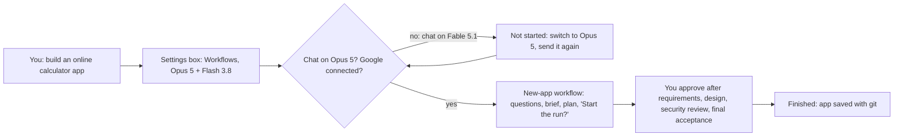
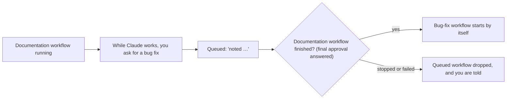
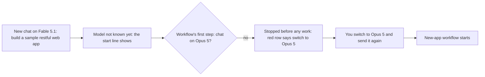
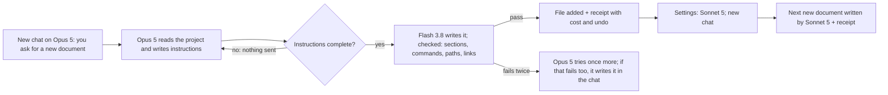
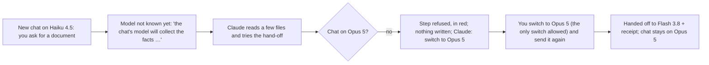
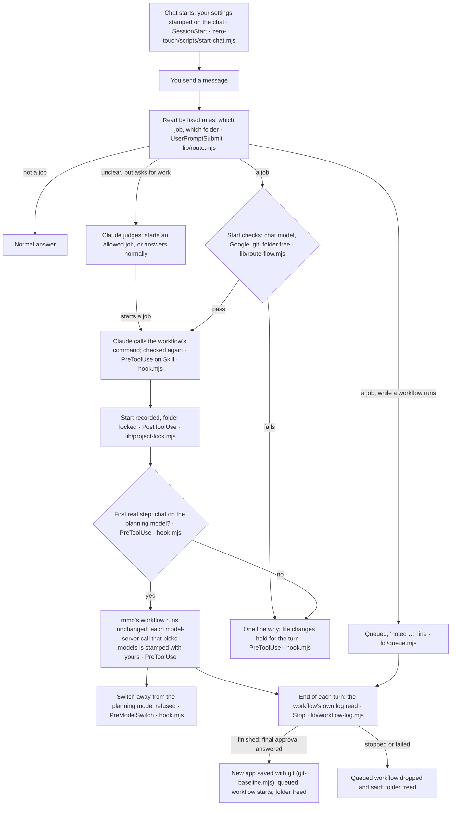
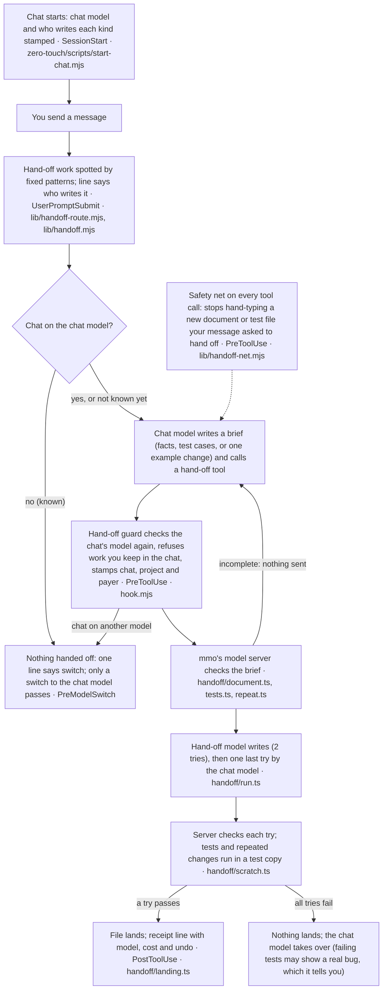

# Zero-touch guide

Ask for software work in plain English. Zero-touch either runs a complete, step-by-step job for you, or lets Claude
write the code while another AI model you choose writes the routine files.

Written for anyone, with no technical background needed: what zero-touch is, how to install and run it, and exactly
what you will see. The last part, [How it works inside](#how-it-works-inside), is for developers. The full reference is
[ambient-mode.md](ambient-mode.md).

**Contents:** [Words to know](#words-to-know) · [What zero-touch does](#what-zero-touch-does) · [Install](#install) ·
[Your settings](#your-settings) · [Workflows mode](#workflows-mode) · [Hand-off mode](#hand-off-mode) ·
[The model choices](#the-model-choices) · [Try it: five scenarios](#try-it-five-scenarios) ·
[If something is off](#if-something-is-off) · [Good to know](#good-to-know) · [How it works inside](#how-it-works-inside)

## Words to know

| Word | Meaning |
|---|---|
| Claude | An AI assistant made by Anthropic. You write to it in a chat, like a message app. |
| Claude Code | The version of Claude that can read and change the files of a software project on your computer. It runs in the Claude desktop app (the Code tab) or in a terminal. |
| Terminal | A text-only window where you type instructions to your computer (on a Mac, the Terminal app). If you use the desktop app, you can skip every note marked "terminal". |
| Chat | One conversation with Claude. Desktop app: the **New** button starts one. Terminal: quit Claude and start it again, or type `/clear`. |
| Model | The AI "brain" that answers. Here: **Opus 5** and **Fable 5.1** (Anthropic's largest), **Sonnet 5** (Anthropic's mid-size), and **Flash 3.8** (Google's; billed by Google, apart from your Claude plan). You pick a chat's model in the model menu next to the message box. In the desktop app, Opus 5 is under **More models**; Opus 5.5, at the top of the menu, is a different model and doesn't count as Opus 5. Terminal: type `/model` and the name, `claude-opus-5`, `claude-fable-5-1` or `claude-sonnet-5`. |
| Plugin | An add-on that teaches Claude Code new things. **mmo** is a plugin that runs full software jobs; **zero-touch** is a plugin on top of mmo. |
| Greenfield, brownfield | mmo's two kinds of job. **Greenfield**: a new app, built from nothing in an empty folder. **Brownfield**: a change to a project that already exists (fix a bug, add a feature, write docs or tests, clean up, upgrade a library). |
| Job, workflow | A **job** is one kind of software work mmo does from start to finish; there are eight (new app, bug fix, and so on). A **workflow** is the step-by-step run that does one job, stopping for your approval at each main step. |
| Chat model | In Hand-off mode, the model you choose to do the development. Zero-touch keeps the chat on it. |
| Project folder | The folder on your computer that holds your software. You open a chat in it: in the desktop app, choose it with the folder button just above the message box before your first message (it can also make a new, empty folder); in the terminal, start `claude` from inside it. |
| git | A tool that saves a project's history. Workflows need it so every change a job makes can be undone; Hand-off uses it to try new tests and repeated changes in a test copy first. |

## What zero-touch does

The mmo plugin can run a complete software job, greenfield or brownfield: write the requirements, design it, write the
code and tests, review it for quality and security, and stop for your approval at each main step. Most of its model
setups plan with a big model and give the code writing to another one. Normally you start it by typing its command:
`/mmo:greenfield` for a new app, `/mmo:brownfield` or one of its per-job commands (such as `/mmo:bugfix`) for an
existing project.

With zero-touch you type no commands. You ask in plain words, and zero-touch does one of three things, depending on
the mode you chose:

| Mode | What happens |
|---|---|
| **Workflows** | "Fix the login bug" starts mmo's complete bug-fix workflow (`/mmo:bugfix`) on the models you chose. It waits for your approval at each main step. Any other message gets a normal answer. |
| **Hand-off** | Claude does the development itself. Writing new documents, new tests, and one change repeated across many files goes to the model you chose for that kind of work, and is checked automatically before it reaches your project. |
| **Off** | Claude works as normal. Nothing is started or handed off. You can still open the settings. |

**Which to choose:** Workflows if you want a whole job done for you, with your approval at each main step. Hand-off if
you build in the chat with Claude and want routine writing given to another model. Off if you want Claude as normal.

Typing mmo's commands yourself (for example `/mmo:bugfix`) still works, whether zero-touch is on, off or not
installed. In a zero-touch chat, one typed while a workflow runs there asks **Queue it** or **Replace it**, and one
typed while another chat runs a workflow in the same folder doesn't start.

### Where zero-touch's lines show

Zero-touch talks to you in short lines starting with "Zero-touch:". The terminal shows them in the chat. The desktop
app folds them into a small collapsed "Claude Code notice"; click it to read them. Inside, each line follows a
technical label such as "UserPromptSubmit says:", which you can ignore. Claude is asked to start its reply with any
line you need to act on, sometimes in its own words. When zero-touch stops a step Claude was taking, that step shows
in red (for example "Failed to …") and holds the line; that is zero-touch doing its job, not a fault. The app also
lists steps zero-touch can't rename, such as "Ran skill /mmo:docs".

## Install

### What your computer needs

You don't have to check these yourself: when you choose your settings, zero-touch checks this computer and says what
is missing and what to do.

| Need | Why |
|---|---|
| Claude Code, signed in (a Claude plan, or an API key) | Zero-touch runs inside it. Get it at claude.com/download. |
| Node.js 20 or newer (nodejs.org) | Zero-touch and mmo are programs written in JavaScript, and Node.js runs them. Without it, or with a version older than 20, zero-touch does nothing: Claude works as normal and tells you once per chat. |
| The `claude` program | A new-app workflow uses it, and so does Hand-off, for a hand-off to Sonnet 5 and for the chat model's last try when a hand-off fails. On a Mac, the desktop app's own copy counts, so you usually need nothing extra. If neither is found, zero-touch says so, and Claude can help install it. |
| git | Workflows on an existing project, and Hand-off's tests and repeated changes, need the project saved with git. A brand-new app needs nothing first. |
| A Google connection, for Flash 3.8 | The standard choice in both modes uses Flash 3.8, Google's model, billed to your Google account. Claude walks you through it (below). |

### Steps

1. In any Claude Code chat, send:

   ```text
   install the zero-touch plugin from the develop branch of github.com/tl-ai-labs/ai-sdlc-orchestrator-claude-code-harness
   ```

   Claude replies that zero-touch is installed, that you should start a new chat, that the new chat will ask how
   zero-touch should work, and with this guide's address.

   By hand, in a terminal chat: `/plugin marketplace add https://github.com/tl-ai-labs/ai-sdlc-orchestrator-claude-code-harness.git#develop`,
   then `/plugin install zero-touch@tilicho-ai-labs`. It must be the develop branch: the main branch doesn't have
   zero-touch yet. If the add answers that the marketplace is already added (for example, you installed mmo from it
   before), it did nothing: run `/plugin marketplace update tilicho-ai-labs`, or, if you added it from the main
   branch, `/plugin marketplace remove tilicho-ai-labs` and add it again as above.
2. **Start a new chat** (desktop app: New; terminal: quit Claude and start it again), in the folder you will work in.
   Before you send anything, pick **Opus 5** in the model menu: the standard choices need it (only Fable 5.1 + Flash 3.8
   needs Fable 5.1 instead). If you used an older mmo before, zero-touch updates it by itself and asks you to start a
   new chat in a minute.
3. **Send your first request** in that chat, or just "hello". Before Claude answers, it opens the settings box (next
   section); in the desktop app it first writes "Welcome to zero-touch. Before I answer, please choose how it should
   work. …". After you choose, zero-touch checks your computer and says "everything these settings need is ready", or
   exactly what is missing and what to do. Your first request is kept: in Workflows mode a job request then starts its
   workflow and anything else gets a normal answer; in Hand-off or Off, Claude answers it. If the line says the chat is
   on the wrong model, switch it and send the request again. If something is missing, fix it, then ask again in a new
   chat.

> **To connect Google**, ask Claude: **help me connect Google for zero-touch**. Claude explains the two ways, one step
> at a time: a Google AI Studio key (the simplest), or a Google Cloud sign-in with a project. Either way, the setting
> goes in Claude's own settings file on your computer, `~/.claude/settings.json` (the desktop app doesn't read your
> terminal's start-up files). You paste the key in yourself: Claude shows you where, but never asks for, reads or
> repeats it. Then start a new chat. Nothing else needs setting up: no `/mmo:setup`, no `/mmo:policy`.

## Your settings

You choose everything by clicking in a question box inside the chat. There is nothing to type and no file to edit.
The first chat after install asks. To change them later, ask in any chat, in any mode, Off included:

```text
change zero-touch settings
```

The exact words don't matter. Anything that names zero-touch works, such as "turn zero-touch off" or "switch
zero-touch to Hand-off": Claude opens the same box, and you choose by clicking.

The box asks for the mode first, then the models for that mode:

| Mode | Then you choose |
|---|---|
| Workflows | Which models do the work: Opus 5 + Flash 3.8 (the standard choice), Fable 5.1 + Flash 3.8, Opus 5 + Sonnet 5, or Opus 5 only ([The model choices](#the-model-choices)). |
| Hand-off | The chat model (Opus 5, recommended, or Sonnet 5), and who writes each kind of routine work: new documents; new tests; one change repeated across files. For each: Flash 3.8, Sonnet 5, or Keep in chat (the chat model writes it itself). The standard is Opus 5, with all three kinds to Flash 3.8. |
| Off | Nothing more. |

The box also says how much of your Claude usage each choice takes, and that Flash 3.8 runs on your Google account.
Your current choices are marked "(your current choice)". Answer every question by clicking a choice: typing in the
box's "Other" line, skipping a question or closing the box saves nothing, and zero-touch says so.

### When a change takes effect

- **From your next new chat.** An open chat keeps the settings it started with, so it never changes behaviour halfway.
- **The first chat after install** uses your answers at once.
- **Off** also reaches chats that are already open, at their next message. A workflow already running there finishes
  first.
- The first new chat after you save shows a short summary once, starting "Zero-touch is on in this chat: Workflows
  mode." (or Hand-off mode): what to ask for, your models, which model the chat must be on, and how to change it. Later
  chats show a line only when something needs you; Off shows nothing. To check any chat, ask "is zero-touch on in this
  chat?".

If a project has its own saved model rules (a `routing-policy.yaml` file, or the choice saved with `/mmo:policy`),
zero-touch ignores them and uses your choices; for a `routing-policy.yaml` file, the chat says so. A `/mmo:` command
you type still follows them. If the settings file is ever damaged, your last good settings are used (or zero-touch
stays off), and every chat tells you to choose again.

## Workflows mode

**First, put the chat on the model that plans:** Opus 5, or Fable 5.1 if you chose Fable 5.1 + Flash 3.8. A
workflow's planning and reviewing run on the chat's own model, so on any other model it doesn't start, and one line
names the model to switch to. On a new chat's first message zero-touch can't see the model yet, so the workflow is
stopped at its first step instead, before any of its work ([scenario 3](#3-the-wrong-chat-model-for-a-job)).

Then ask for a job in English: start with what you want done, and say what it is about. Zero-touch recognises mmo's
eight jobs and starts the same workflow its command would. Ask for a new app in an empty folder, and for every other
job in a project folder saved with git. Each example below is recognised exactly as written:

| Job | For example | Starts |
|---|---|---|
| New app (greenfield) | build a small to-do app | `/mmo:greenfield` |
| Bug fix | fix the /login endpoint returning 500 on missing password | `/mmo:bugfix` |
| Add to an existing feature | add a due date to the to-do form | `/mmo:feature-extend` |
| New feature | add a webhooks module with an endpoint, storage and a retry loop | `/mmo:feature-new` |
| Documentation | write API docs for the auth module | `/mmo:docs` |
| Tests | write unit tests for the pricing functions in src/cart.js | `/mmo:test` |
| Clean-up | clean up the shared date logic into one util module | `/mmo:refactor` |
| Dependency upgrade | upgrade jest from 28 to 29 | `/mmo:deps` |

**You type:**

```text
fix the /login endpoint returning 500 on missing password
```

**You see:**

> Zero-touch: you asked for a bug fix, so Claude is starting the bug-fix workflow. It will wait for your approval at
> each main step.

- **It's mmo's full workflow,** exactly as if you had typed its command, with your chosen models. It stops for your
  approval at each main step (mmo calls these gates; for example the scope, the requirements, the design, the
  security review and the final acceptance). You approve, ask for changes, or say abort.
- **It uses far more of your usage than a normal chat,** because it runs many steps on several AI models. The report
  at the end shows an estimate of what it cost.
- **Every message ends in one of three ways,** and zero-touch makes sure of it: the workflow starts on your models; a
  normal answer; or one line saying why not and what to do (the chat is on the wrong model, Google isn't connected,
  the project isn't saved with git, or another chat is running a workflow in this folder; see
  [If something is off](#if-something-is-off)).
- **Not a job?** Questions, thanks, small edits and anything else get a normal answer. A request the fixed rules can't
  place but that asks for work ("the login page is broken, can you sort that out") is left to Claude, with no
  zero-touch line: Claude starts the matching workflow only if your message clearly asks for that job now (it says
  "Running this as a full bug-fix workflow."), and zero-touch checks that start like any other; otherwise Claude
  answers normally. A very short request that opens like a job, such as "build something", gets: "Zero-touch: this
  wasn't recognised as one of the jobs that get a full workflow, so Claude answers it normally. To start one, say what
  you want done and what it is about." The fixed rules read English only.
- **A project not saved with git** is not changed. Zero-touch says so: ask Claude to **save this project with git**,
  then ask again. A new app is saved with git automatically when its workflow finishes.
- **One workflow per project folder at a time.** Another chat in the same folder is asked to wait.
- **To stop while Claude is working,** send just **stop** or **cancel** (**never mind** works too): the workflow stops
  as soon as Claude's current step ends. At an approval step, answer **abort** instead. Going back in the chat to
  before the workflow started, or `/clear`, also stops it. Anything already changed stays as it is.
- **The chat stays on its model while the workflow runs,** because the workflow's planning and reviewing run on it. A
  switch is refused: "Zero-touch: this chat stays on Opus 5 until the bug-fix workflow ends, because the workflow's
  helpers use this chat's model. You can switch once it has finished." Between workflows you can switch freely.

### Asking for a second job while one runs

**You type, while Claude is working on the bug fix:**

```text
write API docs for the auth module
```

**You see:**

> Zero-touch: noted. The documentation workflow will start by itself when the bug-fix workflow finishes, and it will
> wait for your approval at its first main step.

- **Ask while Claude is working.** While the workflow waits for your approval, or asks you a question, what you type is
  your answer to it, not a new request, and nothing is queued.
- It starts once the running workflow has **finished**, which means you answered its final approval. If the running
  workflow is stopped or fails, the waiting one is dropped and you are told.
- **To replace** the running workflow: answer its next approval step with **abort**, then ask for the new job.
- If you type an mmo command yourself (like `/mmo:docs`) while a workflow runs, a box asks: **Queue it** (it starts,
  exactly as typed, when the running one finishes) or **Replace it** (the running one is stopped and yours starts
  now). Nothing changes until you answer.

## Hand-off mode

Claude, on your chat model, does the real development: reading, deciding, writing new code, fixing bugs, improving
code, reviewing. Only routine writing that a computer can check goes to the model you chose for it (the hand-off
model).

**First, put the chat on your chat model** (Opus 5, unless you chose Sonnet 5). If your organisation sets the chat
model for everyone, the chat stays on that model instead, and the chat says so.

| Kind of work | Requests that are handed off | How it is checked before it reaches your project |
|---|---|---|
| A new document, spec or plan | write a README for this project · draft a design doc for the cache layer · write a test plan for the checkout flow | Claude first collects the facts: words copied exactly from your files, or what you said in the chat. The finished document must have a heading for every section asked for. Every command it tells a reader to type must be one of those facts, and every path or link to your project's own files must exist. The check can't judge whether the wording is right: Claude reads the finished file and fixes anything wrong. |
| New tests | write tests for the parser · fix the login bug and write tests for it (the tests part) | Claude decides what to test. The tests run in a test copy of your project first, and are added only if the result is the expected one. Tests for a bug not fixed yet are expected to fail, and the line says so. |
| One change repeated across files | rename getUser to fetchUser everywhere · do the same in the other three services | Claude makes the change in one file; the hand-off model repeats it. Each edit must change only what the example changed, and your project's own automatic check (such as its tests), if it has one, runs on a test copy first; nothing changes unless it passes. |

Never handed off: new code, bug fixes and clean-ups (a wrong answer there is hard to spot), changes to a document or
test file that already exists ("update the README …"), and comments inside code. Plain requests start no workflow in
this mode; an mmo command you type yourself (like `/mmo:bugfix`) still does.

**You type:**

```text
write a README for this project
```

**You see:**

> Zero-touch: Opus 5 will collect the facts and give Flash 3.8 instructions to write the new document. It's checked
> automatically before it's added to your project.

**Then:**

> Zero-touch: README.md was written by Flash 3.8 and checked automatically. Estimated cost: $0.0030. To undo it, ask
> Claude to undo the hand-off of README.md (going back in the chat doesn't undo it).

On a new chat's first message the line says "the chat's model" instead of "Opus 5", because zero-touch can't see the
model yet. Claude may choose the file name, and the cost differs on every run.

- **Claude's instructions are checked before anything is sent.** If something is missing, a line says nothing was
  sent or charged and Claude fixes them; turned down twice for the same file, Claude writes that file itself.
- **If the hand-off model fails twice,** the chat model tries once more, checked the same way. If that fails too,
  nothing is added and the chat model takes over: it writes a document itself; for tests that keep failing, it fixes a
  wrong test or tells you the code has a real bug; for a repeated change, it changes any file that failed itself (if
  your project's check failed, nothing was changed and it makes the whole change). The line always names who wrote the
  file. Nothing unchecked is added by a hand-off.
- **Undo** by file name, in any chat opened in the same project folder: "undo the hand-off of README.md". A file the
  hand-off created is removed, and a repeated change is undone in all its files at once. If a file was changed since,
  Claude asks you before undoing it. Undo works for 30 days after the chat that made the hand-off was last used, and
  only while zero-touch is installed and switched on. Going back in the chat can't undo it, because the file was
  written outside the chat.
- **Stop** a hand-off with the app's Stop button (terminal: Esc): nothing is added, and your next message brings a line
  saying so.
- **Claude can't quietly do it itself.** When your message asks for a new document or new tests and the chat model
  starts typing that file by hand, zero-touch stops it and has it handed off. To have it written in the chat anyway,
  say **write it yourself**. A file that a script writes, or that is copied in, isn't seen.
- **What it needs:** Google for Flash 3.8; a project saved with git for tests and repeated changes (they run in a test
  copy). Without them, that kind of work is done by the chat model, and a line says why.
- **The chat stays on your chat model for the whole chat.** It does the development on every message and writes every
  hand-off's instructions, so it decides the quality of all the work. Hand-off is one long coding chat, and a switch
  mid-chat also costs extra: the new model has to read the whole conversation again without the saved copy the first
  model had. A switch away is refused: "Zero-touch keeps this Hand-off chat on Opus 5, the chat model you chose,
  because it does the development and decides the hand-offs. To use a different model, type "change zero-touch
  settings", then start a new chat."
- **On another model, nothing is handed off:** "Zero-touch: this chat is on Sonnet 5, but you chose Opus 5 to do the
  development in Hand-off mode, so nothing is handed off until you switch this chat to Opus 5 with the model menu next
  to the message box (in the terminal, type /model claude-opus-5). Then ask again." The only switch allowed is to the
  chat model. On a new chat's first message this comes only when Claude tries the hand-off, as a red step
  ([scenario 5](#5-hand-off-on-the-wrong-model-then-the-right-one)). Other work goes on as plain Claude Code.

## The model choices

### Workflows: the four choices

| Choice | Plans and reviews (the chat must be on it) | Writes the code |
|---|---|---|
| Opus 5 + Flash 3.8 (standard) | Opus 5 | Google's Flash 3.8 |
| Fable 5.1 + Flash 3.8 | Fable 5.1 | Google's Flash 3.8 |
| Opus 5 + Sonnet 5 | Opus 5 | Sonnet 5 |
| Opus 5 only | Opus 5 | Opus 5 |

### Why these choices, and adding more

- **Workflows** offers four of mmo's own model setups, the ones its commands already run: each runs every step of all
  eight jobs on current models, and mmo's own checks accept it. Four is the most choices Claude's question box shows.
  mmo ships nine; the other five use older models (Opus 4.7, or Flash 3.5 or 3.7), use Flash for everything, or repeat
  Opus 5 + Sonnet 5 billed through the `claude` program. A `/mmo:` command you type can still use any of them.
- **Hand-off** offers the writing model of two of those setups: Google's Flash 3.8 (from Opus 5 + Flash 3.8) and
  Anthropic's Sonnet 5 (from Opus 5 + Sonnet 5). A hand-off reads its model from that setup, just as a workflow does.
- **Not offered yet:** any model mmo has no connection to. For example, mmo has no connection to OpenAI's GPT models
  yet, so there is no "GPT + Flash 3.8" workflow and no hand-off to GPT.
- **More models and finer choices can be added** as they are needed. A new model first needs a connection in mmo, and
  more than four Workflows choices would need a second question in the box.

## Try it: five scenarios

Each scenario gives the messages to type and what you will see. Before each one, set the settings on its first line
(type "change zero-touch settings"), start a new chat in the folder it names, and pick the chat's model before your
first message. Scenario 2 is shown on a small project whose parseDate function wrongly accepts 30 February; in your own
project, name a part that is really there. A hand-off only writes new files, so for scenarios 4 and 5 use a project
that doesn't have those files yet.

### 1. A new app from one sentence

*The first chat after install · an empty folder · Workflows · Opus 5 + Flash 3.8*

**You type:**

```text
build an online calculator app
```

**Expect:** the welcome and the settings box ([Install](#steps), step 3). Choose Workflows, then Opus 5 + Flash 3.8.
On Opus 5, the workflow starts from this message. On another model (here, Fable 5.1), the line says:

> Zero-touch: your settings are saved and apply from now on, in this chat too: Workflows mode, Opus 5 + Flash 3.8.
> Your first message hasn't been started as a workflow yet, because of this chat's model (see below): switch it, then
> send your request again.

Then switch the chat to Opus 5 and send the same message again.

**Expect:**

> Zero-touch: you asked for a new app, so Claude is starting the new-app workflow. It will wait for your approval at
> each main step.

The workflow asks a few questions about the app, writes the brief, shows its plan with your models, and asks "Start the
run?" before it spends anything. It then waits for your approval after the requirements, the design and the security
review, and before final acceptance. At the end it reports what each step cost and where the code is, and the line
adds: "The new app is saved with git as a starting point, so the changes you ask for next can be undone."



### 2. A second job while one runs

*Workflows · Opus 5 + Flash 3.8 · chat on Opus 5 · a small project saved with git*

**You type:**

```text
write a README for the date helpers
```

**Expect:**

> Zero-touch: you asked for documentation, so Claude is starting the documentation workflow. It will wait for your
> approval at each main step.

**Then, while Claude is working on it (not while it waits for your approval), type:**

```text
fix the bug where parseDate accepts 2026-02-30 and returns 2 March instead of refusing it
```

**Expect:**

> Zero-touch: noted. The bug-fix workflow will start by itself when the documentation workflow finishes, and it will
> wait for your approval at its first main step.

When you answer the documentation workflow's final approval:

> Zero-touch: the documentation workflow has finished, so the bug-fix workflow you queued is starting now.



### 3. The wrong chat model for a job

*Workflows · Opus 5 + Flash 3.8 · new chat on Fable 5.1 · an empty folder*

**You type:**

```text
build a sample restful web app
```

**Expect:** this is a new chat's first message, so zero-touch can't see the chat's model yet, and the start line shows
first:

> Zero-touch: you asked for a new app, so Claude is starting the new-app workflow. It will wait for your approval at
> each main step.

At the workflow's first step, before any of its work, zero-touch stops it. In the desktop app a red "Failed to …" row
holds the reason:

> Zero-touch: the new-app workflow didn't start, because this chat is on Fable 5.1, but you chose Opus 5 + Flash 3.8,
> where Opus 5 plans and reviews, and that part runs on this chat's own model. Switch this chat to Opus 5 with the
> model menu next to the message box (in the terminal, type /model claude-opus-5), then ask again.

Nothing is built. Switch to Opus 5 and send the message again, and the workflow starts. Once Claude has answered once
in a chat, a job asked for on the wrong model gets only that line, and nothing starts.



### 4. Hand-off: a document to Flash, then to Sonnet

*Hand-off · chat model Opus 5 · all three kinds to Flash 3.8 · a project saved with git · new chat on Opus 5*

**You type:**

```text
write a very short CONTRIBUTING guide for this project
```

**Expect:**

> Zero-touch: the chat's model will collect the facts and give Flash 3.8 instructions to write the new document. It's
> checked automatically before it's added to your project.

Opus 5 reads the project and hands the writing off; the app shows the step as "mmo model-dispatch: write document". If
its instructions miss something, you first see "Zero-touch: Opus 5's instructions for the hand-off were missing 1
thing, so nothing was sent and nothing was charged. Opus 5 is fixing them and will try again." That is normal. Then
the receipt:

> Zero-touch: CONTRIBUTING.md was written by Flash 3.8 and checked automatically. Estimated cost: $0.0030. To undo it,
> ask Claude to undo the hand-off of CONTRIBUTING.md (going back in the chat doesn't undo it).

**Then** type "change zero-touch settings", choose Hand-off, Opus 5, and Sonnet 5 for all three kinds. Start a new chat
on Opus 5 in the same folder and type:

```text
write a very short summary doc about this repo
```

**Expect:** "… give Sonnet 5 instructions to write the new document …", then "Zero-touch: OVERVIEW.md was written by
Sonnet 5 and checked automatically. Estimated cost: $0.02. …". The chat stays on Opus 5. Costs differ on every run.



### 5. Hand-off on the wrong model, then the right one

*Hand-off · chat model Opus 5 · documents to Flash 3.8 · a project saved with git · new chat on Haiku 4.5 (a smaller
Anthropic model, so the wrong one here)*

**You type:**

```text
write a getting started guide for this project
```

**Expect:** a new chat's first message comes before zero-touch can see the model, so the usual line comes first:
"Zero-touch: the chat's model will collect the facts and give Flash 3.8 instructions to write the new document. …"
Claude reads a few files and tries the hand-off. That step is refused and shows in red; opened, it says:

> Zero-touch: this chat is on Haiku 4.5, but you chose Opus 5 to do the development in Hand-off mode, so nothing is
> handed off until you switch this chat to Opus 5 with the model menu next to the message box (in the terminal, type
> /model claude-opus-5). Then ask again.

Claude tells you the same in one sentence. Nothing is written.

**Then** switch the chat to Opus 5 and send the same message again.

**Expect:** "Zero-touch: Opus 5 will collect the facts and give Flash 3.8 instructions to write the new document. …",
then the hand-off and its receipt, as in scenario 4. From now on this chat stays on Opus 5.



## If something is off

| You see | Why | What to do |
|---|---|---|
| "… this chat is on …" | The chat isn't on the model your choice needs | Switch with the model menu next to the message box (terminal: `/model …`), then ask again |
| A red "Failed to …" step | Zero-touch stopped a step; the reason is inside | Open it, or read Claude's reply, and do what the line says |
| "… isn't connected to Google" | Your choice uses Flash 3.8, and there is no Google connection | Ask Claude: **help me connect Google for zero-touch**, or choose models without Flash |
| "… isn't saved with git yet" | Changes to a project are undone with git | Ask Claude to **save this project with git**, then ask again |
| "… this computer doesn't have git …" | git isn't installed | Ask Claude to help you install it, then ask again |
| "… another chat in this project folder is already running a …" | One workflow per folder at a time | Ask again when that one finishes. A workflow that never began frees the folder after 30 idle minutes |
| "this wasn't recognised as one of the jobs …" | Too short or vague to start a workflow on | Say what you want done and what it is about, in English |
| "… this looks like a new app, but this folder already holds a project …" | New apps are built in empty folders | Open an empty folder for a new app, or say what to add or fix in this one |
| "… this asks to change a project, but this folder doesn't hold one yet …" | Changes are made to a project, and this folder is empty | Open your project's folder and ask there, or ask for a new app here |
| "… this asks for two jobs at once …" | One workflow does one job | Ask for one job at a time |
| "… a setting on this computer makes workflow helpers run on …" | Your computer sets `CLAUDE_CODE_SUBAGENT_MODEL` (often set for typed mmo runs) to a model your choice doesn't plan with | Ask Claude to help you change that setting |
| "… workflows from plain words are switched off …" | A setting file in the project, or on this computer, turns this off | Type the `/mmo:` command yourself, or ask Claude to help remove that setting |
| "… Claude Code's command-line program wasn't found …" | The `claude` program is missing | Install Claude Code for the terminal; Claude can help |
| "… a plugin it needs, mmo, is switched off or missing" (or "… is an older version") | Zero-touch runs on mmo | Switch mmo back on, or update it, in your plugin list (desktop app: **+** next to the message box, then Plugins, then Manage plugins; terminal chat: `/plugin`, then Installed), then start a new chat |
| "Zero-touch is updating mmo …" | Zero-touch needs the mmo it was built with | Nothing; start a new chat in a minute |
| "… couldn't read your settings" | The settings file is damaged | Type **change zero-touch settings** and choose again |
| "… the Claude sign-in this computer uses … has expired" | A hand-off to a Claude model couldn't sign in | In a terminal, run `claude` and type `/login` |

## Good to know

- **Costs.** A hand-off receipt and a workflow's final report show an estimate: the models' list price for what was
  used.
- **Permission questions.** Claude Code may ask before Claude changes a file or runs a command, depending on its
  permission setting. These are Claude Code's own questions, not a workflow's approval steps. While a workflow runs,
  its own bookkeeping steps go ahead without asking. In Hand-off, a new document and an undo go ahead without asking;
  new tests and a repeated change may ask, and show the command that checks them in the test copy.
- **What it keeps.** Your settings are kept in zero-touch's own plugin folder and are deleted when you remove it. Each
  chat gets a small record in `~/.mmo-ambient` on your computer, holding no message text, removed 30 days after the
  chat was last used. Nothing of zero-touch's own goes into your project.
- **If zero-touch itself keeps failing in a chat** (three errors), it switches off in that chat and says so. Claude
  carries on as normal, and a new chat starts fresh.
- **Turning it off.** Choose Off in the settings: open chats stop at their next message. Or disable the plugin, which
  reaches new chats: desktop app, **+** next to the message box, then Plugins, then Manage plugins; terminal chat,
  `/plugin`, then Installed. Undo any hand-off you want undone first, because undo needs zero-touch on. To remove it
  completely, in a terminal: `claude plugin uninstall zero-touch@tilicho-ai-labs --prune`. This deletes your
  zero-touch settings, and also removes mmo if it came with zero-touch (so the `/mmo:` commands go too); leave out
  `--prune` to keep mmo.

## How it works inside

*For developers.*

Zero-touch's code lives in two plugins. The **zero-touch** plugin holds the settings box and marks each new chat with
your settings when it starts. It also registers the workflow and hand-off **hooks**: small programs Claude Code runs at
fixed moments, namely when a chat starts, when you send a message, before every tool call, after a workflow's start, a
question box or a hand-off, when the model is switched, when Claude's turn ends (or ends in an error), and when
`/clear` ends a chat. Each hook runs code kept in the **mmo** plugin, so without zero-touch none of it runs and mmo
behaves exactly as before. mmo's model server does the hand-off work and checks the results. In the diagrams, `lib/` is
`plugin/scripts/ambient/lib/` and `handoff/` is `plugin/mcp/model-dispatch/src/handoff/` (both in mmo).

mmo's workflow helpers (the orchestrator, the architect and the reviewers) name no model, so Claude Code runs them on
`CLAUDE_CODE_SUBAGENT_MODEL` when it is set, and otherwise on the chat's model; zero-touch changes nothing about that.
When that setting is set, it must name the planning model, and the chat's model is neither checked nor locked. When the
only Claude sign-in is an API key (`ANTHROPIC_API_KEY`) that the model server bills directly, the chat's model is not
checked or locked either.

### Workflows: what runs at each step



### Hand-off: what runs at each step



### The five scenarios, inside

| Scenario | What acts, in order |
|---|---|
| Settings (every scenario) | The settings hook gives Claude the exact box and saves your answers whole (`zero-touch/scripts/settings-hook.mjs`, `boxes.mjs`, `settings.mjs`) → the setup check (`readiness.mjs`, `google.mjs`) → the start hook stamps them on the next new chat (`start-chat.mjs`, `mark.mjs`) |
| 1 New app | Message hook recognises a new app in an empty folder (`lib/route.mjs`) and checks the model and Google (`lib/route-flow.mjs`) → command guard checks again (`hook.mjs`) → start recorded, folder locked (`lib/project-lock.mjs`) → model-server calls stamped → end-of-turn hook reads the log (`lib/workflow-log.mjs`) and saves the app with git (`git-baseline.mjs`) |
| 2 Second job | The first workflow starts as in 1 → message hook queues the second and says "noted" (`lib/queue.mjs`) → end-of-turn hook sees the first finished (`lib/workflow-log.mjs`) and starts the queued one |
| 3 Wrong model | Start check can't see the model yet and lets it through (`lib/route-flow.mjs`) → tool guard stops the workflow at its first step and holds the turn (`hook.mjs`) |
| 4 Hand-off document | Message hook spots a new document (`lib/handoff-route.mjs`, `lib/handoff.mjs`) → hand-off guard stamps the call (`hook.mjs`) → server checks the brief, runs the tries, checks the answer (`handoff/document.ts`, `run.ts`) → receipt and undo record (`handoff/landing.ts`) |
| 5 Hand-off, wrong model | The chat's real model is read (`lib/handoff.mjs`) → the hand-off is refused at the call (`hook.mjs`) → after the switch, the model-switch hook lets only the chat model through (`hook.mjs`) |
